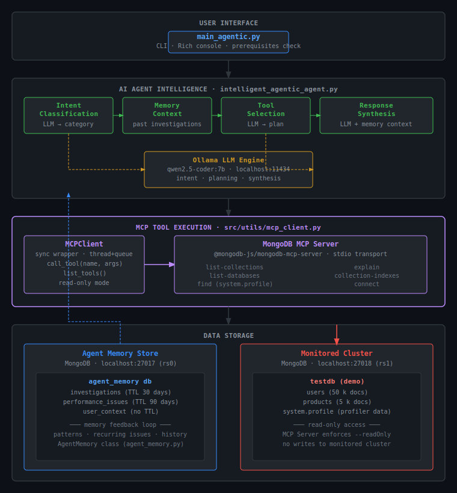

# MongoDB DBA Agent

## Overview

Agentic AI system for MongoDB database administration that learns from past investigations and provides intelligent recommendations.

**Key Features:**
- **Natural Language Interface**: Understands human queries like "my database is slow"
- **Intelligent Analysis**: LLM-driven tool selection and reasoning
- **Persistent Memory**: Learns from past investigations using MongoDB storage
- **Local Operation**: No external API calls - runs entirely on local infrastructure

**Scope**: Foundation system for performance analysis, metadata inspection, and query optimization with memory-enhanced learning capabilities.

## Architecture



See [detailed architecture documentation](architecture_diagram.md) for complete system design.

### Core Components

- **CLI Interface** (`main_agentic.py`) - Rich console interface with prerequisites checking
- **Intelligent Agent** (`intelligent_agentic_agent.py`) - LLM-driven analysis with memory integration
- **Analysis Tools** - SlowQueryFetcher, QueryExplainer, IndexChecker, MetadataInspector
- **Memory System** (`agent_memory.py`) - MongoDB-based persistent learning
- **Dual MongoDB Setup** - Agent memory store (27017) and monitored database (27018)


### Workflow
1. **Intent Analysis** - LLM classifies user requests (metadata, performance, general)
2. **Memory Lookup** - Retrieves context from past investigations  
3. **Tool Selection** - LLM chooses appropriate analysis tools
4. **Execution** - Runs selected tools and collects results
5. **Synthesis** - Generates memory-aware recommendations
6. **Storage** - Saves investigation for future learning

## Quick Start

### Prerequisites
- Python 3.11+
- MongoDB 8.0+ (two instances: ports 27017, 27018)
- Ollama with qwen2.5-coder:7b model

### Installation
```bash
# 1. Setup environment
python3 -m venv venv
source venv/bin/activate
pip install -r requirements.txt

# 2. Start MongoDB instances
mongod --config ~/mongodb/config/mongod.conf      # Agent memory (27017)
mongod --config ~/mongodb/config/mongod2.conf     # Monitored DB (27018)

# 3. Setup LLM
ollama serve
ollama pull qwen2.5-coder:7b

# 4. Generate demo data
python create_demo_scenario.py
```

## Usage

```bash
source venv/bin/activate

# Example queries
python src/main_agentic.py "how many collections do I have"
python src/main_agentic.py "my database is slow"
python src/main_agentic.py "check slow queries"
```

**Supported Query Types:**
- **Metadata**: "how many collections", "show database info"
- **Performance**: "database is slow", "check slow queries" 
- **General**: "hello", "what's your name"

## Configuration

`config/agent_config.yaml`:
```yaml
mongodb:
  agent_store: "mongodb://localhost:27017"     # Memory storage
  monitored_cluster: "mongodb://localhost:27018" # Target database
  
ollama:
  base_url: "http://localhost:11434"
  model: "qwen2.5-coder:7b"
  
agent:
  slow_query_threshold_ms: 5
  max_queries_to_analyze: 10
```

## Project Structure

```
src/
├── agent/
│   └── intelligent_agentic_agent.py  # Core AI agent
├── memory/
│   └── agent_memory.py              # MongoDB memory system
├── tools/
│   ├── slow_query_fetcher.py        # Profiler analysis
│   ├── query_explainer.py           # Query explain() analysis
│   ├── index_checker.py             # Index optimization
│   └── metadata_inspector.py        # Database metadata
├── utils/
│   ├── mongodb_client.py            # Database connections
│   └── config_loader.py             # Configuration management
└── main_agentic.py                  # CLI entry point
```

## Capabilities

**Intelligence Features:**
- Natural language understanding and intent classification
- Dynamic tool selection based on LLM reasoning
- Memory-aware recommendations from past investigations
- Persistent learning with MongoDB-based storage

**Analysis Tools:**
- Slow query detection from MongoDB profiler
- Query explain() analysis and optimization
- Index coverage analysis and recommendations 
- Database metadata and schema information

**Memory System:**
- Investigation history (30-day TTL)
- Performance issue tracking (90-day TTL)
- Recurring problem detection and context building

## Current Scope

**Designed For:**
- Local development and testing
- MongoDB Community Edition analysis
- Educational and proof-of-concept use

**Extensible To:**
- Multiple database clusters
- Remote LLM providers (GPT, Claude)
- MongoDB Enterprise and Atlas integration
- Web dashboard and automated monitoring

## Technical Foundation

- **Local-First**: No external API dependencies
- **LLM-Driven**: Semantic reasoning vs hardcoded rules
- **Memory-Enhanced**: Learns from past investigations
- **Modular Design**: Extensible tool and memory architecture

Proof-of-concept demonstrating agentic AI for database operations with persistent learning capabilities.

## Contributing

See [architecture documentation](architecture_diagram.md) for system design details.

## License

MIT License

